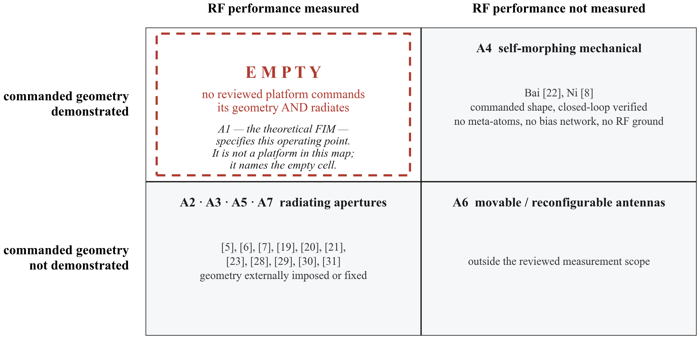
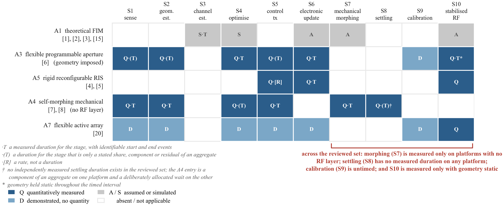

# Flexible Intelligent Metasurfaces for High-Mobility ISAC

### Hardware Evidence, Adaptation Timescales, and Validation Gaps

This repository accompanies a **structured critical review** of flexible intelligent
metasurfaces (FIMs) in high-mobility integrated sensing and communication. It carries the
manuscript, the evidence records behind every claim in it, and the scripts that reproduce the
literature search and the consistency checks.

It is the author's manuscript of a review that **has not been submitted to or accepted by any
venue**. No journal, volume, page range, acceptance date or peer-review status is claimed
anywhere in it. This is a **structured critical review, not a systematic review** — the
distinction is argued in `documentation/article_type_assessment.md` and matters for how the
counts below should be read.

Current snapshot: manuscript **v0.30e**, documentation **v1.24** — see
[`CURRENT_VERSION.md`](CURRENT_VERSION.md).

---

## What this project demonstrates

A short orientation for a reader arriving without context. Each item links to where the work
itself is, and each is bounded by the limitations in §9.

- **Architecture-aware analysis of FIM hardware evidence** — reported timing evidence is read
  against the platform class that produced it, so a measurement is never transferred to a
  platform that could not have produced it. [`documentation/architecture_taxonomy.md`](documentation/architecture_taxonomy.md)
- **A ten-stage adaptation framework** — adaptation is decomposed from sensing to stabilised
  radiation, and every source is assessed against the same ten stages on two axes: what it
  establishes about a stage, and what it establishes about how long that stage takes.
  [`documentation/adaptation_chain_matrix.md`](documentation/adaptation_chain_matrix.md)
- **A 35-entry timing register with explicit definitions** — every reported value carries its
  timed object, start event, end event and measurement status, so two values are compared only
  when they are genuinely comparable. [`documentation/supplement_timing_register.md`](documentation/supplement_timing_register.md)
- **A citation-traceability analysis** — hardware-feasibility premises traced through the
  citation chain to the primary measurements behind them, with every count stated as a lower
  bound. [`documentation/audits/citation_audit.md`](documentation/audits/citation_audit.md)
- **Reproducible literature-search and consistency-check scripts** — the forward-citation
  retrieval and the validators that hold the prose to the registers both run from
  [`tools/`](tools/), offline, against committed records.
- **A full review manuscript and supplementary evidence package** — seven sections, four
  figures, 36 bibliography entries and the registers behind them.
  [`manuscript/COMPLETE_MANUSCRIPT.md`](manuscript/COMPLETE_MANUSCRIPT.md)

The manuscript is **unpublished and not peer reviewed**, extraction was performed by a single
reviewer, and no domain-expert review has taken place. §9 states the limitations in full.

---

## 1. Research question

> Which operations in a FIM-assisted high-mobility ISAC system must track fast channel
> variation, which may follow slower geometric or statistical change, and how well are the
> resulting timescales supported by existing hardware and control demonstrations?

## 2. Why this matters

In high mobility the propagation channel changes quickly: path lengths change as the vehicle
moves, so each path's phase turns at its own rate and the received sum changes continuously.

A FIM adds a second control variable to a reconfigurable surface — the **physical shape** of the
aperture, alongside the electromagnetic state of its elements. That is what makes it attractive,
and it is also what makes timing a hardware question rather than a modelling one: changing an
electromagnetic state is limited by the tuning mechanism and control path, while changing
geometry additionally introduces actuator, structural-response and damping timescales.

Several system studies place shape adaptation inside a fast, channel-tracking loop. This review
asks what has actually been *measured* about the intervals that argument depends on.

## 3. Key findings

- **Within the reviewed set, no experimental platform combines commanded geometry with measured
  RF performance.** Mechanical timing evidence comes from A4 platforms that command their
  geometry but have no radio-frequency layer; radio-side timing evidence comes from the
  externally deformed A3 aperture and rigid A5 panels, which do not command their geometry.
  The intersection is empty, and the reason is architectural rather than incidental.

- **No reviewed source measures the duration of more than 4 of the ten adaptation
  stages**, and the platform that reaches 4 has no radio-frequency layer.

- **Timing values that look comparable often time different objects, start events and
  endpoints.** They may be compared only within a comparability class; an element-level update
  time cannot stand in for an aperture-level configuration time.

- **The 16.76 ms value reported in [7] is a compensation latency**, running from shape
  acquisition to bias-voltage supply. It is not a complete FIM response time: it begins after
  the shape exists and stops before RF stabilisation is measured.

- **Tracing the hardware-feasibility premises to their primary sources** found
  5 scope-change instances across 4 studies, among the
  13 of 20 candidate citing studies whose full texts were accessible.
  Those studies form one connected co-authorship network. **Every count is a lower bound on a
  partially observed set; no prevalence is claimed.**

## 4. Contributions

| | |
|---|---|
| **C1** | **C1 — Architecture-aware adaptation-chain framework.** FIM adaptation is decomposed into ten stages from sensing to stabilised radiation, and each source's treatment of each stage is coded on two axes: what the source establishes about the stage, and what it establishes about how long the stage takes. Applied to the reviewed set, no platform measures the duration of more than four of the ten stages, and the platform reaching four has no radio-frequency layer. |
| **C2** | **C2 — Definition-preserving timing register.** Every reported value is recorded with its timed object, start event, end event and measurement status, and values may be compared only within a comparability class. Two common simplifications fail that test: an element-level update time cannot stand in for an aperture-level configuration time, as one panel's own two bounds show; and the reported ranges for electronic and mechanical processes overlap once the tuning mechanism is named, so an architecture label alone does not order them. |
| **C3** | **C3 — Traceability audit of the hardware-feasibility premises.** Three premises from the FIM system literature are traced to the primary measurements behind them. Among the 13 of 20 candidate citing studies whose full texts were accessible, four reuse a timing value with its scope changed, and those four form one connected co-authorship network; the remainder cite the same hardware and attach no timing value at all. Every count is a lower bound on a partially observed set, and no prevalence claim is made. Section 5.2 gives the instances and the bounds. |
| **C4** | **C4 — Validation gap and reporting set.** Four intervals are unmeasured in the reviewed set, and the reporting fields we propose prescribe definitions — object, start event, end event — rather than acceptance thresholds. |

## 5. Repository map

| Path | Purpose | Start here? |
|---|---|---|
| [`REVIEW_INDEX.md`](REVIEW_INDEX.md) | Reading order, every supporting record, load-bearing claims and their evidence classification | **Yes — read this first** |
| [`manuscript/COMPLETE_MANUSCRIPT.md`](manuscript/COMPLETE_MANUSCRIPT.md) | The whole manuscript in one file (generated — edit the section files instead) | Yes, to read straight through |
| `manuscript/` | Front matter, seven numbered sections, references, figures | — |
| `documentation/` | Evidence matrices, timing register, source inventory, search log, seven audits | When checking a specific claim |
| `documentation/audits/` | Standing audits: architecture, citation, evidence, independence, latency definition, redundancy, terminology | — |
| `review/REVIEW_MANIFEST.md` | File-by-file provenance for this snapshot | — |
| `tools/` | Retrieval, register builders and every consistency validator | To reproduce the audit |
| [`CURRENT_VERSION.md`](CURRENT_VERSION.md) | Which snapshot this is, the private commit it came from, and the open blockers | — |
| [`SOURCE_VERSION_MAP.md`](SOURCE_VERSION_MAP.md) | Every bibliography entry against the version actually inspected | — |
| [`CHANGELOG.md`](CHANGELOG.md) | Dated change history | — |

## 6. Reproducing the audit

Python 3.11+, no third-party packages required for the validators.

```bash
python3 tools/validate_public_snapshot.py     # the full snapshot gate
python3 tools/check_manuscript_claims.py      # prose against the registers
python3 tools/check_s11_consistency.py        # no stale counts anywhere
python3 tools/check_supplement_matrix.py      # supplement against the chain matrix
python3 tools/check_corpus_counts.py          # corpus totals agree across statements
python3 tools/c1_stage_counts.py              # C1 stage maxima, recomputed
python3 tools/s11_counts.py                   # the whole retrieval flow as JSON
python3 tools/check_mirror_links.py .         # every relative link resolves
```

The forward-citation retrieval itself is reproducible from
`tools/reproduce_forward_citation_search.py` (network access required; the archived result set
is committed, so the checks above run offline).

## 7. Key figures

**Figure 1 — the architecture evidence map.** Two axes, both properties of an *experiment*: has
the platform demonstrated commanded geometry, and has RF performance been measured on it? Three
cells are populated. The cell requiring both is empty.



**Figure 3 — the adaptation chain by architecture class.** Which of the ten stages each class
supplies evidence for, and of what kind.



## 8. Data and evidence status

| | |
|---|---|
| Corpus | **24 distinct research contributions** across 34 files (26 unique documents) |
| Bibliography | **36 entries** |
| Timing register | complete **35-entry register**, each row carrying its timed object, start event, end event and measurement status |
| Adaptation chain | ten stages, S1–S10 (S1-G and S1-C are analytical sublabels of one stage) |
| Architecture classes | A1–A7 |
| Validation gaps | G1–G4 |
| Forward-citation flow | 306 records → 262 unique works → 65 stage-1 → 24 records → 20 studies → **13 read / 7 unread** |

The corpus PDFs themselves are **not** in this repository — see §10.

## 9. Limitations

Stated plainly, because they bound every count above.

- This is a **structured critical review, not a systematic review.** It makes no completeness
  claim over the literature.
- The corpus was **assembled by convenience**, not by an exhaustive protocol-driven search.
- **Extraction and classification were performed by a single reviewer** and were not
  independently duplicated or adjudicated. No domain-expert review has occurred.
- **7 of the 20 candidate citing studies are behind paywalls and were
  not read in full.** Every forward-citation count is therefore a **lower bound**, and no
  prevalence is estimated.
- No headline adaptation interval in the manuscript carries an uncertainty, because no reviewed
  source reports repetitions or dispersion for one.
- Stage-2 screening and full-text extraction remain single-reader judgements. Retrieval and
  stage-1 screening are exactly reproducible from `tools/`; stages 2–3 are auditable per work
  rather than re-derivable.

`CURRENT_VERSION.md` carries the current list of open blockers, and `REVIEW_INDEX.md` §F states
the limitations against the specific claims they bound.

## 10. What is deliberately excluded

No journal or conference PDFs, no publisher supplementary files, no private study or preparation
material, no credentials and no local filesystem paths are present in this repository or its
history. The authoritative working repository — which holds the downloaded corpus — is private
and stays private.

This mirror is regenerated from it by a one-way, whitelist-based sync; nothing flows back. Each
sync corresponds to exactly one private commit, recorded in `CURRENT_VERSION.md`. See
[`LICENSE_OR_NOTICE.md`](LICENSE_OR_NOTICE.md) for the copyright position on this repository and
on the works it cites.

## 11. Citation and status

If you refer to this work, cite it as an **unpublished manuscript**, version
v0.30e. Machine-readable metadata is in [`CITATION.cff`](CITATION.cff).

> Ahmad, A. *Flexible Intelligent Metasurfaces for High-Mobility ISAC: Hardware Evidence,
> Adaptation Timescales, and Validation Gaps.* Manuscript v0.30e, 2026.
> Unpublished; not peer reviewed.

## 12. Author

**Abdulrahman Ahmad** — Electrical and Computer Engineering, Constructor University.

---

<sub>Snapshot generated 2026-09-08 22:01 UTC from private commit `a93d679f6d45c8609d1979429d86e3b1be586bdc`.</sub>
